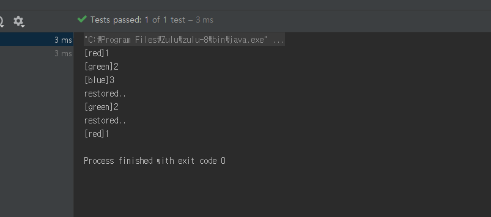

# 메멘토 패턴(memento pattern)

커맨드 패턴을 탐구하다 보면, 명령했던 커맨드를 롤백하고 싶을 때나, 커맨드 스택을 별도의 로깅으로 남기고 싶을 때가 있다. 

단순하게 저장이나 롤백이 필요한 객체 안에서 이러한 행위를 관리하는 방법으로 접근해볼수 있지만, 이 경우 해당 객체가 변하거나 삭제되거나 하는 부분에 대해서 어떻게 대처할것인가? 란 문제가 생긴다.

이러한 경우 메멘토 패턴을 적절히 섞으면 매우 유용하게 접근이 가능하다.

## 목적

객체 상태를 스냅샷 하거나, 이전 상태로 돌리는 개념이 필요할 때. 

## 구현

다른 예제를 보면 너무 단순하고, 실무와는 괴리감이 있더라. 마침 baeldung 에서 매우 적절한 예제를 다루고 있어서 이를 조금 보완해서 접근해보았다.

GOF 책에 귀띰 돠는 것처럼 CareTaker 역활을 하는 객체가 Memento 조차 인지하지 못하게 하는 캡슐화를 표현하고 싶었다. 

TextEditorTest#restore() 를 실행 하면 아래처럼, 잘 동작한다. 

## ref

- https://www.baeldung.com/java-memento-design-pattern
